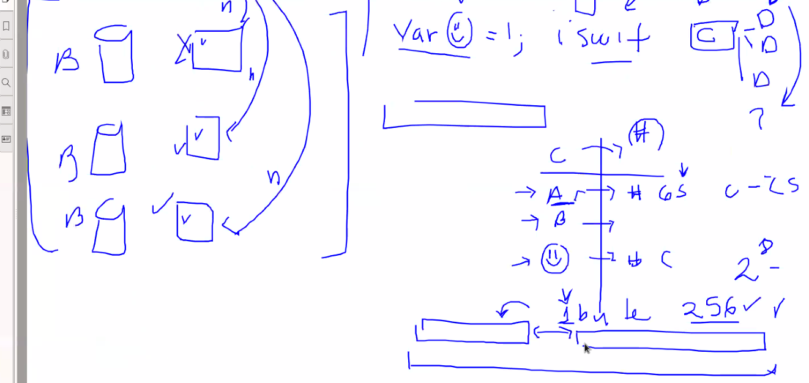
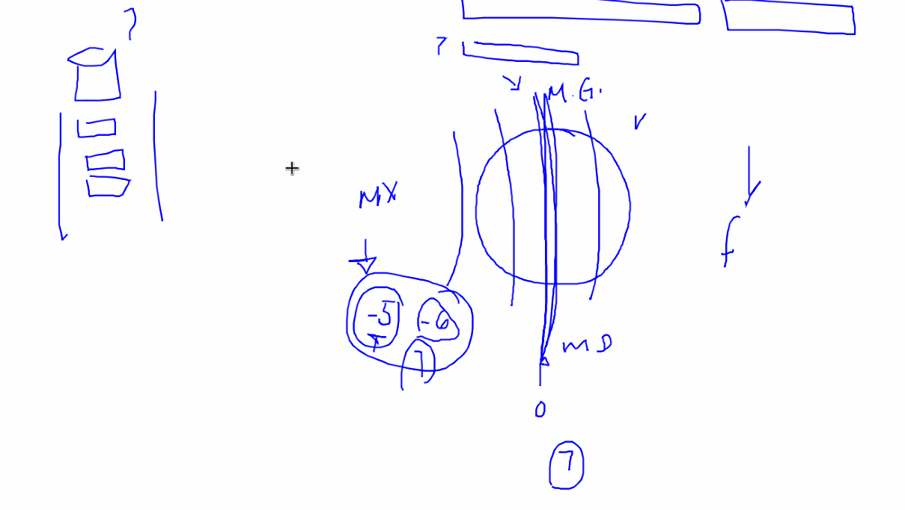
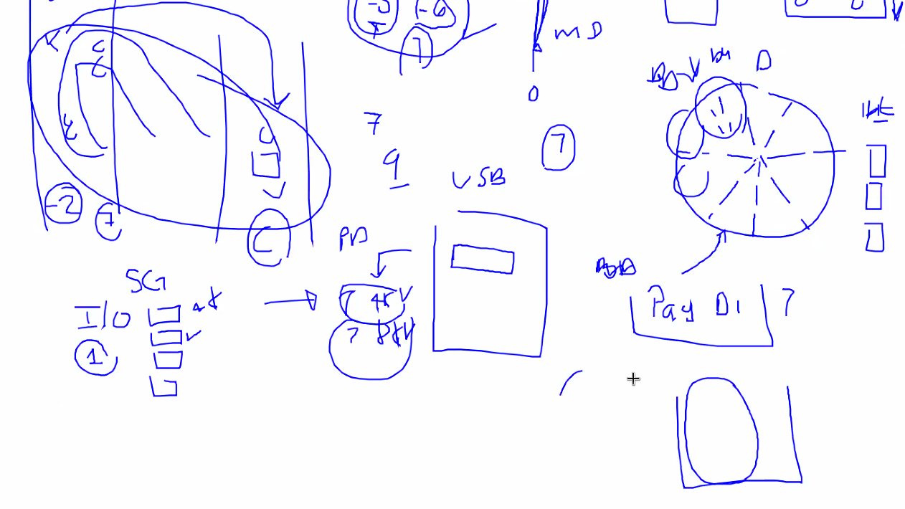
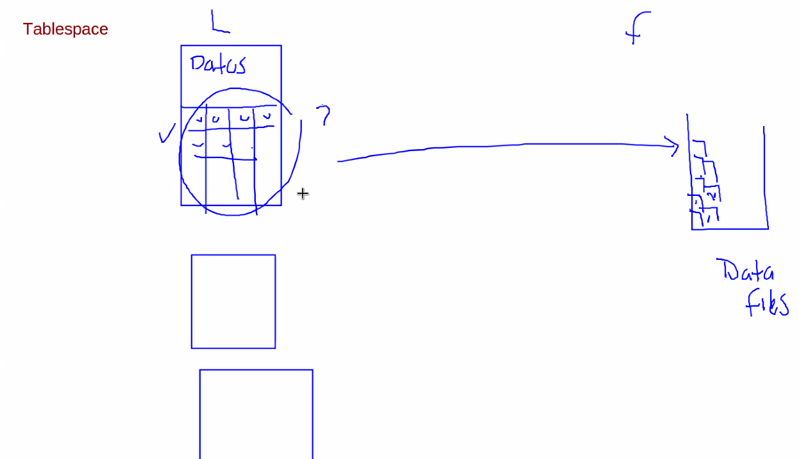
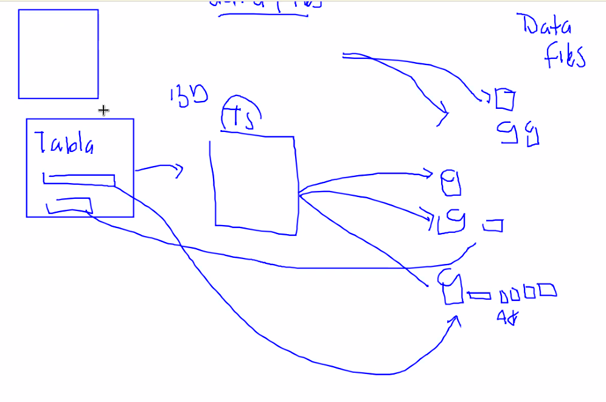
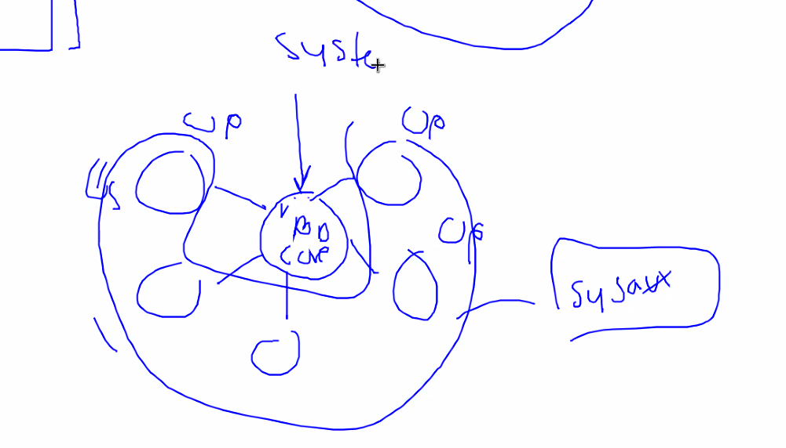
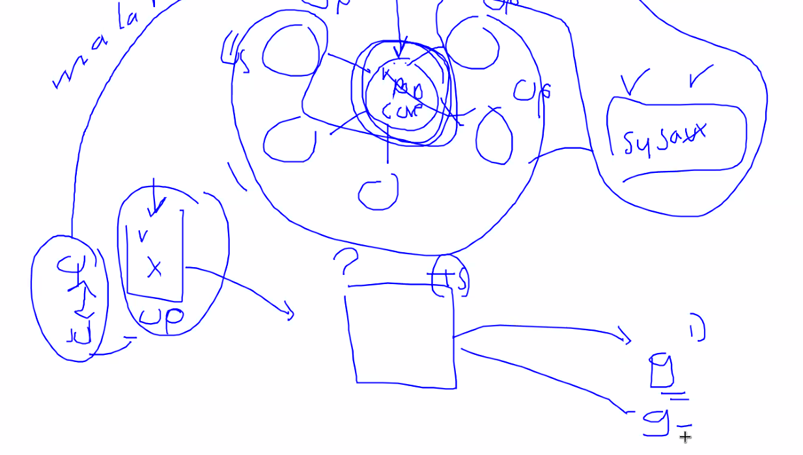
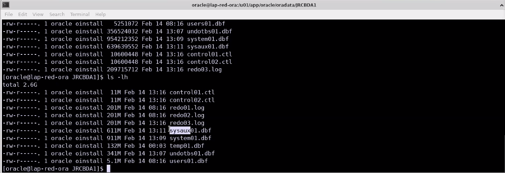
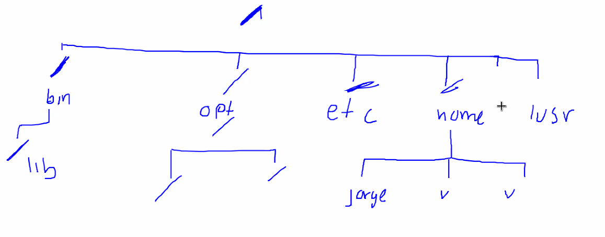
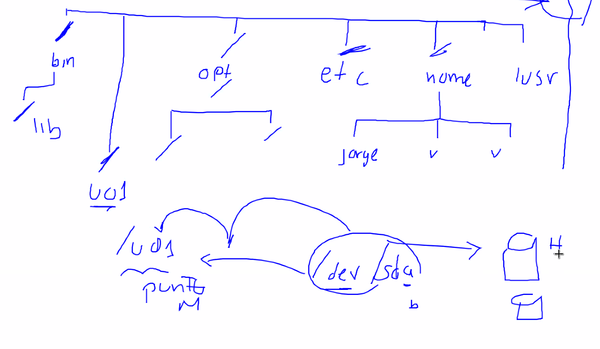

# Tema 1
 
* Instancia = Areas de memorias
* BD donde está la colección de datos. Cuando usamos el comando `start up` levantamos una instancia.

# Usuarios que se crean al crear la base de datos

|||
|--|--|
|||

# Arquitectura RAC
Se usa mucho esta arquitectura porque pueden apuntar a una misma instancia y aumentar la redundancia.
<div></div>

# Privilegio de administración

* Un `Rol DBA` es un conjunto de privilegios.
Los privilegios hacen especiales a los usuarios, normalmente se crean al crear la base de datos, los más comunes son `sysdba`, `sysoper` y `sysbackup`.

* El usuario `sys` no puede existir sin `sysdba` porque es el dueño de la base de datos. Es el conjunto de datos para hacer prácticamente todas las operaciones en la base de datos. Tiene el poder de leer cualquier cosa.

Es posible convertir un usuario con todos los poderes a nivel de sys. Para ello

* `sysoper` es parecido a `sys` pero con un poco menos de. Una de las principales diferencias con `sys` es que no puede ver los datos de los usuarios. Este usuario se asocia con un esquema llamado **public**. Public contiene todos los objetos de acceso publico para cualquier usuario.

* `sysbackup`, `sysdg`, `syskm`, `sysrac` el privilegio es igual al usuario creado anteriormente.

# Usuario con privilegio de administración

Para ello es importante conocer el concepto de *esquema*.

* Es algo que asocia un conjunto de objetos. Un esquema es como una bolsa o contenedor y a ese contenedor se le agregan objetos, ahí pueden ir: `tablas`, `vistas`, `sinónimos`, `indices`. 
* Un esquema tiene un **nombre** y un **dueño**. La *relación entre esquema y dueño siempre es 1 a 1*. El nombre del esquema coincide con el nombre del usuario.

<div></div>

Estos objetos tienen la peculiaridad de que al instalar ya existen. Estos objetos son los objetos **core** para que la BD funcione. Por ejemplo los diccionarios donde se almacenan las tablas, vistas y en general todos los metadatos.

* Si comenzamos a crear objetos sin que tengan que ver con sys se considera como una mala práctica.

* Cuando creamos un usuario estaremos usando al usuario que le corresponde.

Atraves de privilegios podemos hacer que un usuario pueda acceder a otros esquemas.

# Esquema segun el privilegio
|Privilegio|Esquema|
|--|--|
|`sysdba`|Esquema Sys|
|`sysoper`| Esquema Public|
|`sysbackup,sysdg,sysrac`|El esquema asignado sys|
|`syskm`|Esquema syskm|

# Usuario

# Esquema con otros privilegios (Switch de esquemas)
Cuando usamos un privilegio de administración la cosa cambia, por ejemplo si le damos el privilegio de `sysdba` entonces inicia con otro esquema. Por ejemplo:

* Tendrá la capacidad de conectarse como usuario normal y tener el esquema de su nombre.
* Si le asignamos `sysdba` Si se inicia con un comando de administrador cambia a otro esquema, por ejemplo `sys`.
* Si le asignamos `sysoper` podrá acceder a `public`

Es decir, si le damos un privilegio el usuario puede **Switchear** entre esquemas.

No se puede tener 2 esquemas a la vez, sólo 1 a la vez.

* Cuando se inicia como `sys` también cambia la identidad, por ejemplo, en vez de ser `yanni` será `sys`.

<div></div>


# Revisar la configuración inicial de nuestro ambiente rlwrap

## Personalizacion del promp SQL
|||
|--|--|
|`sqlplus`|Sirve para entrar a sql|
|`sqlplus /nolog`|Permite usar SQLPlus sin tener|
|`connect sys as sysdba`|Conecta como sys|
|`export ORACLE_SID=ymmdba1`||
|`sqlplus / as sysdba`||

Si usamos `whereis sqlplus` nos da la ruta donde está el SQLplus.

* El usuario sys siempre debe ir acompañado de su privilegio `connect sys as sysdba`. 

Cuando estamos conectados como un usuario es `SQL>`. Pero lo que haremos es cambiarlo para el usuario y la instancia. En un scrip podemos personalizarlos en un Script.

* Usar el comando `sudo rm -rf /tmp/rlwrap.debug`

## Personalizar Promp

```
cd #ORACLE_HOME
PWD
ls
cd sqlplus/
pwd
cd admin/
pwd
ls
nano glogin.sql
```
Cualquier comando de SQL que se ponga en `glogin.sql` se ejecutará cuando demos `connect en el sql plus`. se deberán poner las siguientes líneas.

<div></div>

Este prompt tendrá la sig estrcutructura: `test@ymmdba1` 

```
--define el editor para el buffer
define _editor=nano

--personalizar el prompt
define prompt_value=idle
col prompt_name new_value prompt_value
col prompt_name noprint
set heading off
set termout off
select lower(sys_context('userenv','current_user')
  ||'@'||sys_context('userenv','db_name')) as prompt_name
from dual;
set sqlprompt '&prompt_value> '
set heading on
set termout on
col prompt_name print
```
* La variable `_editor` nos permite configurar un editor de código en SQL cuando esquivoquemos.

* Como cambiar de contraseña un usuario en SQLPlus: `alter user sys identified by system1`

## Maneras de entrar a SQLPlus:
|commando|Descripcion|
|--|--|
|`sqlplus sys as sysdba`|Pide password cuando instalamos la base de datos, en este caso `system1`|
|`sqlplus usuario`|Iniciará sesión como usuario, esto pedirá constraseña|
|`sqlplus usuario/password as sysdba`|Autentica exponiendo el password|
|`show user`|Mostrará el usuario que inició sesión|
|`select sys context('USERENV','CURRENT_SCHEMA') as schema from dual`|Función que nos permite contener un dato del concepto del esquema|
|`create user yanni01 identified by yanni quota unlimited on users;`|Creación de usuario con quota ilimitada en el tablespaces `users`|
|`drop user yanni01 cascade`| Elimina un usuario existente, la sentencia cascade es para eliminar todos los objetos relacionados al usuario|

* Para recuperar el archivo de passwords podemos usar el de otra BD y cambiar las contraseñas.
* Spool es como una bitacora en donde irá guardando el historial de comandos. 


```
spool /home/jorge/Desktop/e-t01-01-ymm.txt

create user yanni01 identified by yanni quota unlimited on users;

grant create session, create table yanni01;

grant sysdba to yanni01
grant sysoper to yanni01
```

* El tablespace **users** almacena todos los objetos de los usuarios.
* Despues de crear un usuario no tiene acceso a nada por ello debemos asignar **Grants**

# Métodos de autenticacion para los usuarios con privilegios de administración

* Diccionario de datos (Cuando la BD está iniciada)
* Archivo de passwords (útil cuando la BD no está iniciada)
* A través del SO
* Empleando un servicio de autenticacion externo (directory-based authentication service, ejemplo: Oracle Internet Directory).

Via **SO** permite iniciar sesion prácticamentepor pertenecer al SO.

|Commando ||
|`connect / as sysdba`|Autenticación via SO siempre y cuando pertenezca a los grupos|
|`connect / as sysoper`||

Si quisieramos hacerlo con un usuario que no tiene a nivel SO entonces marca error diciendo que el usuario y passwords son incorrectos.

<div></div>

Para hacerlo tendriamos que cambiar al usuario Oracle, ese si nos permitirá hacerlo.

<div></div>


## Formato de salida

|Comando|Función|
|---|---|
|`set linesize window`|Permite establecer un linesize para la ventana|
|`col username format a20`|Establece un valor de a20 para la sesión|
|`col last_login format a40`|Mostrará la fecha de login en formato a40.Cuando no sale nada es porque aun no se autentica.|

* El comando `col` sólo se usa con VARCHAR, para valores númericos esto puede causar cosas raras.

* Consulta a una vista `select username, sysdba, sysoper, sysback, last_login from v$pwfile_users`

* Todos los ejecutables se encuentran en la ruta `bin`, uno de ellos es la misma base de datos, el sqlplus. Todas las utilerias y programas de la base se encuentran ahí, incluidos el archivo `ora.pwd`

## Ejercicio 4 perdida del archivo de passwords

Simulación de la perdida de el archivo de passwords.

1. Para ello primero hay que detener la base de datos.

    Con el comando `shutdown`

2. Conectarse como usuario `oracle`

3. Crear la carpeta `backups`. Normalmente debe usarse esta carpeta para almacenar algo importante. Por ejemplo la creación de los spools.

4. Mover el archivo de passwords a backup con el comando `mv orapwymmdba1 /home/oracle/backups`

    a. ¿Que pasa si no existe? pero queremos autenticar? 

      Si es posible usar `sqlplus / as sysdba` y permite autenticar porque estamos via **SO**, incluso al poner el comando `show user`. Eh incluso podemos levantar la instancia con este mismo usuario.


    b. ¿Levanta la instancia? Sí

    c. ¿Que pasa si realizamos la consulta de la vista?

      `desc v$pwfile users`
      `select username, sysdba, sysbackup from v$pwfile users;`

      Esta ultima vista nos muestra que no hay registros, pero nisiquiera el archivo `sys` existe. **Es importante saber que el archivo de passwords es el que alimenta esta vista**

      Si intentamos acceder mediante el usuario normal mediante el comando `sqlplus sys as sysdba` nos pedirá la contraseña y seguirá pidiendo siempre contraseña porque no logra acceder. 

      Suponga que el archivo de passwords se pierde, el archivo de passwords ¿Podrá autenticar un usuario no admin? Cierto mediante el diccionario de datos. (tiene todas las contraseñas de todos los usuarios que no tienen privilegio de administracion)

      Al perder el archivo de passwords los usuarios con permisos administrativos no pueden autenticar.

5. Mediante la carpeta `/unam-bda` (Los directorios `/home` son privados para cada usuario por lo que puede causar problemas de permisos). 
    * Oracle no tiene el comando **sudo** y es mala práctica ponerle poder a nivel SO.

    * Cambiando a raiz con el usuario administrador
      
      ````
      cd /
      
      sudo mkdir unam-bda
      
      chmod 744    #Significa que root podrá hacer cualquier cosa, cualquier otro usuario y grupo podrán leer pero no ejecutar ni escribir.

      cd unam-bda

      sudo mkdir apuntes

      ll  #Permite lista con permisos

      sudo chown jorge:jorge apuntes

      sudo chmod 755 apuntes #Sirve para darle permiso a Oracle de ejecutar

      ll

      cd apuntes/
      ls

      mkdir tema01

      ll

      chmod 755 tema01

      cd tema01

      ls

      code restaura-archivo-pwd.sh  #Se usará shell script porque usara un comando de SO

      ```

6. Creando el comando SH.
7. Ejecutar el script mediante el usuario **Oracle** porque están en la carpeta que está dentro de $ORACLE_HOME 

    ```
    su -l oracle
    ls
    cd tema01/

    ls

    ll

    #En primera instancia por permisos no podrá ejecutarlo por permisos.
    ```

    * Pero el usuario no puede tampoco puede ejecutar el script porque permisos en este caso nisiquiera el dueño tiene permisos de ejecución porque se tienen `-rw-rw-r--`

    * Se deben cambiar los permisos.
      `chmod 755 restaura-archivo-pwd.sh`

    * Para darnos cuenta que podemos ejecutar, usamos `ll` y aparecerá en color verde.

    * Ejecutar el ejecutable: `./restaura-archivo-pwd.sh`

    * Cuando se anda ejecutando no permitirá meter una contraseña menor a 8 char, por ejemplo, podemos usar `Hola1234#`

8. Intentando autenticar con el archivo de password: `sqlplus sys/Hola1234# /as sysdba` Sólo por esta ocasión ponemos este password ahí.

    * Si hacemos consulta a la vista
    ```
    col usrname format a20
    col last_login format a40
    set linesize window

    run
    select username,sysdba,sysoper,sysbackup,last_login from v$pwfile_users
    ```

    * Cambiando el password del usuario.
      `alter user`


## Formas de autenticar

|||
|||
|`sqlplus yanni/password`|Se autentica mediante Diccionario de datos|
|`su -l yanni \n  sqlplus sys as sysdba`|Mediante archivo de passwords|
|``|Autenticación mediante Sistema operativo sólo si estamos como Oracle|

# 16-feb


## Juego de caracteres

El ideal implementado por Oracle es `AL32UTF8` porque es dinámico respecto al uso de almacenamiento.

<div></div>

Dependiendo el caracter puede variar desde 1 byte o más. o menos.

## Zona horaria
Si no se configura la zona horaria en la BD entonces se configura la del Sistem Operativo.

**Ofset** Es muy importante para sistemas en donde las fechas y horas son muy importantes. Es la diferencia horaria, en este caso `-2 horas` o algo semejante.

<div></div>

* **Bloque de datos**. Normalmente separa el disco en diferentes bloques, a esto se le conoce como `Página de disco` (normalmente es para los DataFiles)

    Es la división de los pedazos de ese tamaño. Estos pedacitos.

    Particiones de la maquina `df -h`

    <div></div>

    No es bueno tener un espacio tan grande porque se desperdicia espacio en disco. Se tendrán huecos muy grandes desperdiciado haciendo que no se use correctamente el disco. Este valor se almacena en **db_block_size=4096**. **UNA VEZ CREADA LA BD EL TAMAÑO DE BLOQUE NO SE PUEDE MODIFICAR**

* Definir tamaño para almacenar **Redologs** para ver el tamaño establecido podemos usar. `select blocksize v$sysstat`.

|||
|--|--|
|`df -h`|Lista las particiones de los datos|
|`sudo blockdev --getbsz /dev/sda5`|Ver tamaño de bloque, en este caso nos mostraría la unidad mínima de lectura y escritura en nuestra BD. Normalmente está asociado al valor de nuestro SO. Este parametro está en **db_block_size=4096**|
|`show parameter db_block_size`|Nos muestra el valor del tamaño de bloque|

## Tablespace

De forma lógica se guardan como tablas, pero en forma lógica es guardan en forma de bloque, algo completamente diferente al formato tabular

<div></div>


* **Relacion Tabla y Tablespace**
    Una tabla se asocia a un tablespace. Es un mapeo que nos permite decir en que datafiles podemos almacenar los datos de una tabla.

    Los datos de una tabla pueden estar en más de un datafile si el tablespace lo indica.

    **Todas las tablas deben tener su tablespace**

    <div></div>

Por lo menos se deben crear 2 tablespaces, el **system** y el **sysaux**. Cuando se configura el TS se especifica el tamaño inicial y final

Los componentes **core** se almacenan en **system** los datos adicionales hacia los core se almacenan en **sysaux**

Debe haber un tablespaces donde los usuarios guarden sus propios datos, si no se crean entonces se irán almacenando en **system** sin embargo esto es una mala práctica.

<div></div>

La idea es que el usuario tenga su tablespace:

<div></div>

```
su -l oracle
cd $ORACLE_HOME
cd $ORACLE_BASE
ls
cd oradata/
ls -lh
```

Los archivos con la terminación `dbf` son los datafiles. Normalmente al crearse la base de datos se le asigna una capacidad de 1GB a System y Sysaux

<div></div>

Cada aplicación que corra en su BD debería tener su propio diseño de tablespace y datafile. Todo esto debe ser diseñado.

Tablespace **undo**. RollBack nos permite regresar al punto anterior. si se tiene una transacción muy larga y se hace un rollback entonces todas ellas se descartan y volvemos a la versión anterior. Esto lo obtiene del tablespace **undo** que es donde se almacenará toda la o las versiones anteriores. 

Las buenas prácticas mencionan que deberiamos tener almenos los siguientes tablespaces:

|Nombre|Lo que almacena|
|--|--|
|`system`|Todos los archivos core|
|`sysaux`|Todos los archivos alrededor de core|
|`systmp`|Todos los archivos temporales de sesion|
|`users01`|Todos los archivos generados por el usuario o aplicación|
|`undo`|Toda la información  referente a la versión anterior, para que el rollback recurra a este tablespace|

# Creacion de la BD empleando la instrucción DataBase

A partir de este punto hay que usar el comando `export ORACLE_SID=ymmbda#`

## Simulación de discos con LoopDevice

Un **Loopdevice** es un archivo binario donde podemos almacenar datos, este archivo físico podemos utilizarlo como un disco. Permite simular discos mediante el `LoopDevice` para ello primero hay que crear el archivo físico y configurarlo. Podemos crear tantos LoopDevices como queramos con el comando `mknod`

Un sistema de archivos UNIX tenemos una estructura jerarquica iniciando por el directorio raíz.

<div></div>

Mapeo de **punto de montaje**, todo lo que esté debajo de `u01` no se montará dentro del archivo raíz, sino que será dentro de **U01**

<div></div>

Con el comando `mount`le decimos que el contenido de `U01` se monte.

`https://codeshare.io/9OQRL8`