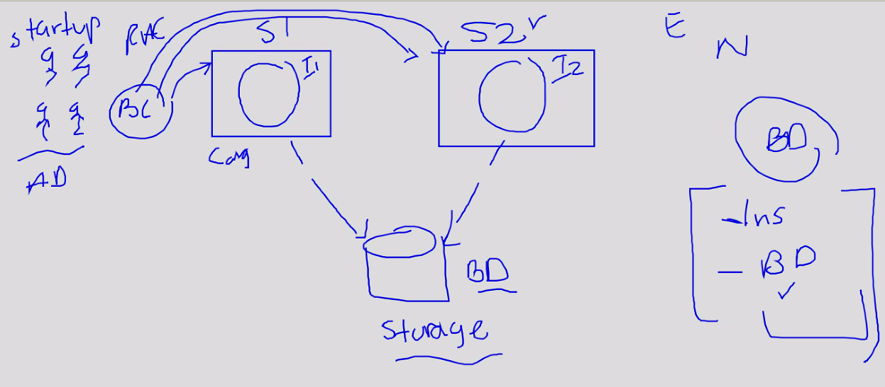
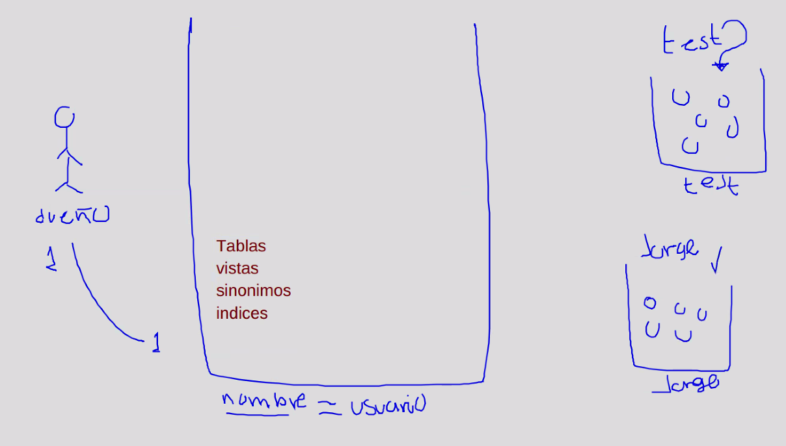
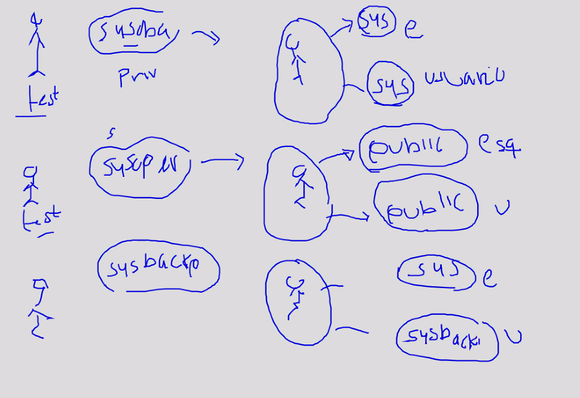
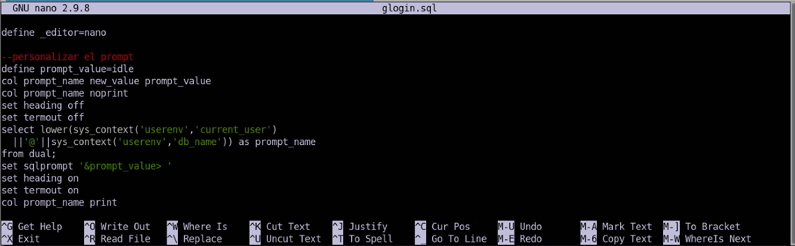
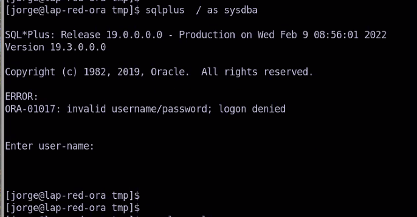
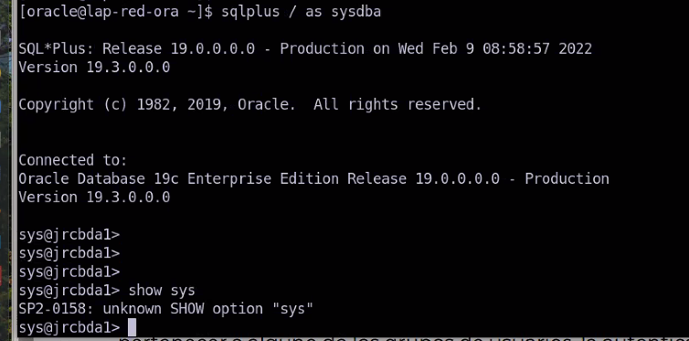

# Tema 1
 
* Instancia = Areas de memorias
* BD donde está la colección de datos. Cuando usamos el comando `start up` levantamos una instancia.

# Usuarios que se crean al crear la base de datos

|||
|--|--|
|||

# Arquitectura RAC
Se usa mucho esta arquitectura porque pueden apuntar a una misma instancia y aumentar la redundancia.
<div></div>

# Privilegio de administración

* Un `Rol DBA` es un conjunto de privilegios.
Los privilegios hacen especiales a los usuarios, normalmente se crean al crear la base de datos, los más comunes son `sysdba`, `sysoper` y `sysbackup`.

* El usuario `sys` no puede existir sin `sysdba` porque es el dueño de la base de datos. Es el conjunto de datos para hacer prácticamente todas las operaciones en la base de datos. Tiene el poder de leer cualquier cosa.

Es posible convertir un usuario con todos los poderes a nivel de sys. Para ello

* `sysoper` es parecido a `sys` pero con un poco menos de. Una de las principales diferencias con `sys` es que no puede ver los datos de los usuarios. Este usuario se asocia con un esquema llamado **public**. Public contiene todos los objetos de acceso publico para cualquier usuario.

* `sysbackup`, `sysdg`, `syskm`, `sysrac` el privilegio es igual al usuario creado anteriormente.

# Usuario con privilegio de administración

Para ello es importante conocer el concepto de *esquema*.

* Es algo que asocia un conjunto de objetos. Un esquema es como una bolsa o contenedor y a ese contenedor se le agregan objetos, ahí pueden ir: `tablas`, `vistas`, `sinónimos`, `indices`. 
* Un esquema tiene un **nombre** y un **dueño**. La *relación entre esquema y dueño siempre es 1 a 1*. El nombre del esquema coincide con el nombre del usuario.

<div></div>

Estos objetos tienen la peculiaridad de que al instalar ya existen. Estos objetos son los objetos **core** para que la BD funcione. Por ejemplo los diccionarios donde se almacenan las tablas, vistas y en general todos los metadatos.

* Si comenzamos a crear objetos sin que tengan que ver con sys se considera como una mala práctica.

* Cuando creamos un usuario estaremos usando al usuario que le corresponde.

Atraves de privilegios podemos hacer que un usuario pueda acceder a otros esquemas.

# Esquema segun el privilegio
|Privilegio|Esquema|
|--|--|
|`sysdba`|Esquema Sys|
|`sysoper`| Esquema Public|
|`sysbackup,sysdg,sysrac`|El esquema asignado sys|
|`syskm`|Esquema syskm|

# Usuario

# Esquema con otros privilegios (Switch de esquemas)
Cuando usamos un privilegio de administración la cosa cambia, por ejemplo si le damos el privilegio de `sysdba` entonces inicia con otro esquema. Por ejemplo:

* Tendrá la capacidad de conectarse como usuario normal y tener el esquema de su nombre.
* Si le asignamos `sysdba` Si se inicia con un comando de administrador cambia a otro esquema, por ejemplo `sys`.
* Si le asignamos `sysoper` podrá acceder a `public`

Es decir, si le damos un privilegio el usuario puede **Switchear** entre esquemas.

No se puede tener 2 esquemas a la vez, sólo 1 a la vez.

* Cuando se inicia como `sys` también cambia la identidad, por ejemplo, en vez de ser `yanni` será `sys`.

<div></div>


# Revisar la configuración inicial de nuestro ambiente rlwrap

## Personalizacion del promp SQL
|||
|--|--|
|`sqlplus`|Sirve para entrar a sql|
|`sqlplus /nolog`|Permite usar SQLPlus sin tener|
|`connect sys as sysdba`|Conecta como sys|
|`export ORACLE_SID=ymmdba1`||
|`sqlplus / as sysdba`||

Si usamos `whereis sqlplus` nos da la ruta donde está el SQLplus.

* El usuario sys siempre debe ir acompañado de su privilegio `connect sys as sysdba`. 

Cuando estamos conectados como un usuario es `SQL>`. Pero lo que haremos es cambiarlo para el usuario y la instancia. En un scrip podemos personalizarlos en un Script.

## Personalizar Promp

```
cd #ORACLE_HOME
PWD
ls
cd sqlplus/
pwd
cd admin/
pwd
ls
nano glogin.sql
```
Cualquier comando de SQL que se ponga en `glogin.sql` se ejecutará cuando demos `connect en el sql plus`. se deberán poner las siguientes líneas.

<div></div>

Este prompt tendrá la sig estrcutructura: `test@ymmdba1` 

```
--define el editor para el buffer
define _editor=nano

--personalizar el prompt
define prompt_value=idle
col prompt_name new_value prompt_value
col prompt_name noprint
set heading off
set termout off
select lower(sys_context('userenv','current_user')
  ||'@'||sys_context('userenv','db_name')) as prompt_name
from dual;
set sqlprompt '&prompt_value> '
set heading on
set termout on
col prompt_name print
```
* La variable `_editor` nos permite configurar un editor de código en SQL cuando esquivoquemos.

* Como cambiar de contraseña un usuario en SQLPlus: `alter user sys identified by system1`

## Maneras de entrar a SQLPlus:
|commando|Descripcion|
|--|--|
|`sqlplus sys as sysdba`|Pide password cuando instalamos la base de datos, en este caso `system1`|
|`sqlplus usuario`|Iniciará sesión como usuario, esto pedirá constraseña|
|`sqlplus usuario/password as sysdba`|Autentica exponiendo el password|
|`show user`|Mostrará el usuario que inició sesión|
|`select sys context('USERENV','CURRENT_SCHEMA') as schema from dual`|Función que nos permite contener un dato del concepto del esquema|
|`create user yanni01 identified by yanni quota unlimited on users;`|Creación de usuario con quota ilimitada en el tablespaces `users`|
|`drop user yanni01 cascade`| Elimina un usuario existente, la sentencia cascade es para eliminar todos los objetos relacionados al usuario|

* Para recuperar el archivo de passwords podemos usar el de otra BD y cambiar las contraseñas.
* Spool es como una bitacora en donde irá guardando el historial de comandos. 


```
spool /home/jorge/Desktop/e-t01-01-ymm.txt

create user yanni01 identified by yanni quota unlimited on users;

grant create session, create table yanni01;

grant sysdba to yanni01
grant sysoper to yanni01
```

* El tablespace **users** almacena todos los objetos de los usuarios.
* Despues de crear un usuario no tiene acceso a nada por ello debemos asignar **Grants**

# Métodos de autenticacion para los usuarios con privilegios de administración

* Diccionario de datos (Cuando la BD está iniciada)
* Archivo de passwords (útil cuando la BD no está iniciada)
* A través del SO
* Empleando un servicio de autenticacion externo (directory-based authentication service, ejemplo: Oracle Internet Directory).

Via **SO** permite iniciar sesion prácticamentepor pertenecer al SO.

|Commando ||
|`connect / as sysdba`|Autenticación via SO siempre y cuando pertenezca a los grupos|
|`connect / as sysoper`||

Si quisieramos hacerlo con un usuario que no tiene a nivel SO entonces marca error diciendo que el usuario y passwords son incorrectos.

<div></div>

Para hacerlo tendriamos que cambiar al usuario Oracle, ese si nos permitirá hacerlo.

<div></div>

`https://codeshare.io/9OQRL8`