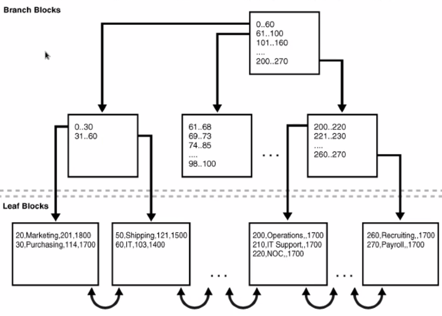
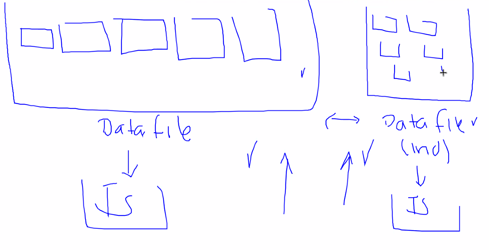
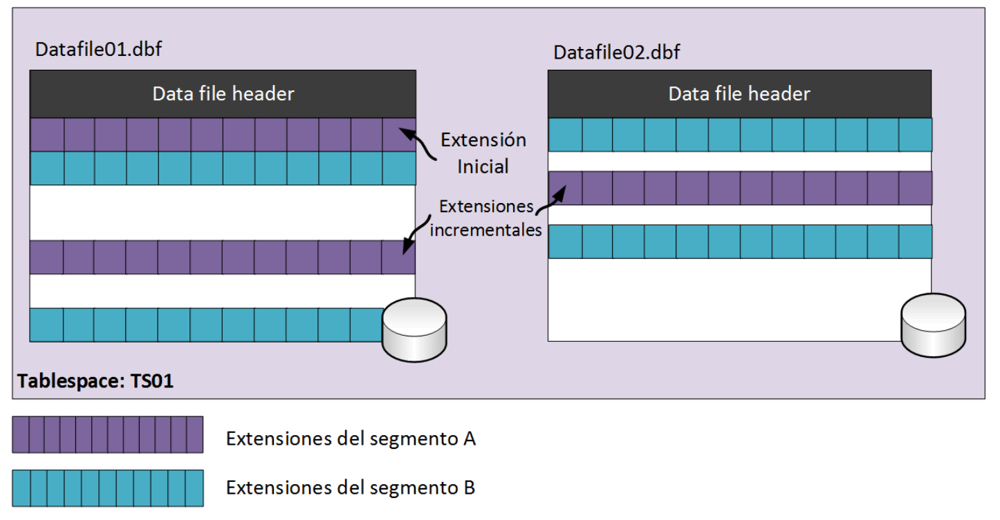
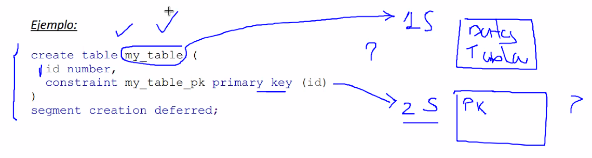
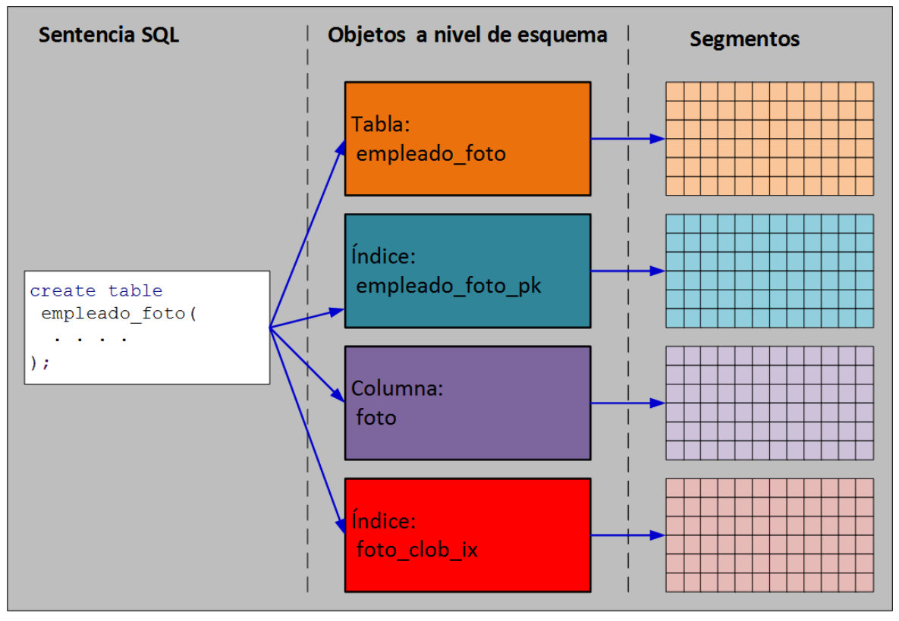
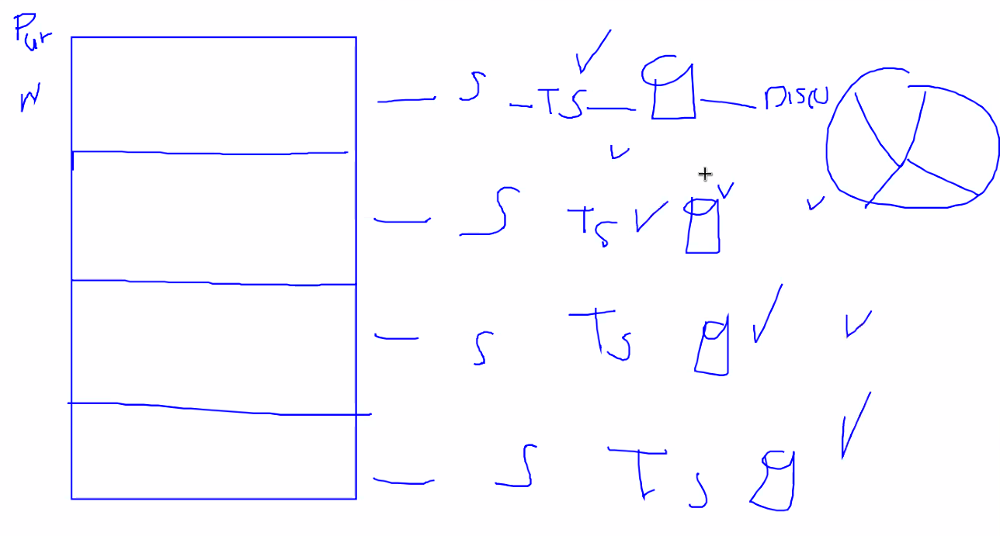
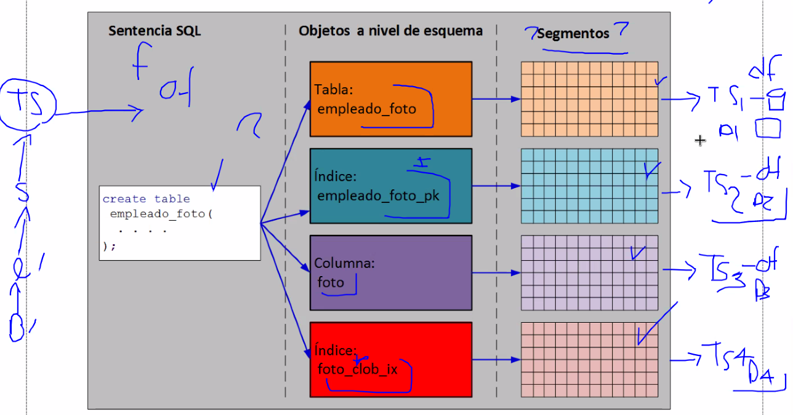
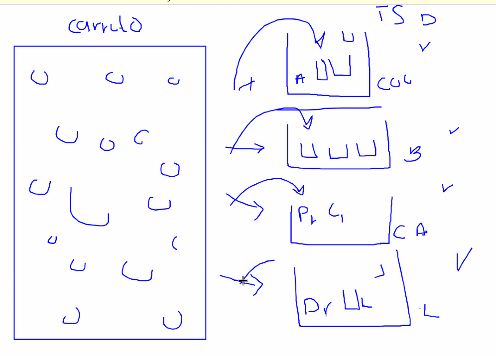

# Tema 6 Parte 1 Administracion de las estructuras lógicas de almacenamiento

* Estructuras lógicas de almacenamiento
* Estructuras físicas

Las estructuras lógicas de almacenamiento son reconocidas unicamente por la base de datos, no por todo el SO.

### Logica para entender relaciones entre las estructuras:

* Una extensión que conforma por un conjunto de bloques.

* El segmento es un conjunto de extensiones. Cada segmento se asocia con un objeto por ejemplo una tabla.

* Tablespace es un conjunto de segmentos.

* Un tablespace puede estár formados o asociados por distintos datafiles.

Un datafile es una estructura física y el tablespace es lógico.

Un datafile está formado por un conjunto de extensiones.

Un bloque (logico) se liga con un bloque del SO.

Normalmente si la tabla se llama estudiante el segmento también se llamará así.


¿Cuanto espacio tiene almacenado un tabla? podemos ver cuantas extensiones tien la tabla asignada, vemos los bloques y obtenemos el almacenamiento.

Cada segmento se le asigna a un objeto (tabla), cad auno de ellos tiene tuplas o columnas.


## Bloques de datos

Es la unidad minima de lectura y escritura.
`db_blocksize` define la cantidad del espacio.

El header contiene informacion como dirección de disco, tipo de segmento, informacion de direcciones.

* Table directory

* Row directory

En el header se muestra si el bloque requiere de un recovery, etc.

### Ejemplo

La siguiente instrucción obliga que el bloqe tenga almenos un 20% de espacio libre el cual podrá ser destinado a realizar actualizaciones a los registros existentes. 

`create table test(id number) pctfree 20;`

Si el valor no se reserva  muy probablemente existirá la posibilidad de migración de registros. Por default se registra un 10%

* OLAT: Son Bases de datos transaccionales.

* OLAP: Bases de datos que caen muy bien al ser estáticas. Normalmente son usadas para ananlítica.

Instrucciones que pueden incrementar el espacio libre:
* delete
* update (el nuevo dato es de menor longitud). Si ocurre lo contario, el registro pudiera requerir ser migrado a otro bloque
* Insert Hacen uso de compresión de datos.
    * Una instrucción insert podría hacer uso del espacio liberado por otra instrucción bajo las siguientes condiciones:
    * La instrucción que libera espacio se ejecuta primero y ambas instrucciones pertenecen a la misma transacción.
    * La instrucción que libera espacio se ejecuta primero, pertenece a una transacción diferente a la instrucción insert. En este caso la instrucción insert podrá hacer uso del espacio hasta haber realizado commit.

## Encadenamiento de registros

Si la table tiene demasiadas columnas usando tipos de datos `LONG ó LONG RAW`, hoy en día se usan **Clob** (Tipos de caracteres, por ejemplo, columnas donde el varchar no es suficientes, lo diferente al varchar y number es que son un apuntador) y **Blob** que permite almacenar documentos o imagenes.`

Realmente lo que se guarda en las columnas Clob o Blob es un puntero hacia el documento o imagen.

Antes de que existieran `clob y blob` existian los `LONG ó LONG RAW` no eran punteros, sino que almacenaba directamente en la columna todo este tipo de objectos.

Cuando almacenamos `blob y clob` generamos un segmento.

Lo que pasa es que el registro no se parte, sino que se lleva a un bloque nuevo donde quepa:

Una vez asignado el `rowid` ya no se mueve. El encadenamiento va a ocurrir cuando el registro tiene que partirse para que quepa.

Lo más común es que exista una migración sobre todo si tenemos un `pctfree` muy pequeño. si tenemos tablas muy pequeños podriamos tener el pctfree cercano a 0, en caso de que crezcan deberiamos aumentarlo para que no existan un gran numero de migraciones (mucha migracion puede afectar el performance).

## INDEX BLOCKS

Un indice requiere de almacenamiento. La unica diferencia es el contenido. Cada uno de los nodos que puede tener un indice ocupan un bloque. En un indice real el número de etiquetas puede ser considerablemente mayor. 
El indice de una llave primaria artificial podria ser el siguiente:

<div></div>

A diferencia de los datos de una tabla, los datos o “keys” de los índices se almacenan de forma ordenada en los Index blocks.
* La defragmentación de este tipo de bloques no es automática, se debe ejecutar `alter index <nombre_indice> rebuild o coalesce`.
* Esta operación permite que las hojas del árbol B se reduzcan.

Si son tablas muy grandes podemos tener el siguiente diseño:

<div></div>

Es decir, separar por completo el almacenamiento del contenido y del indice.

Nota: Aquí se termina el concepto de bloques. (examen P2 llega hasta segmentos)

## EXTENSIONES

Es un conjunto de bloques continuos.

Imaginemos 2 datafiles (el datafile contiene muchos bloques) y se agrupan en extensiones. Cada conjunto de bloques forman una extensión y estas a su vez se asocian a un segmento (dicho de otra forma a una tabla).

Podemos imaginar que las extensiones de color morado se refieren al `cliente` y las de color azul es `orden de cliente`

<div></div>

Cuando se crea una tabla unicamente se crea su segmento (el cual tendrá el mismo nombre) el segmento está asociado a un Tablespace. Hasta este momento sólo se crean los metadatos.

<div></div>

El primer insert es tardado porque aun no se reserva el espacio. Se solicita que se cree una nueva extensión. "Oye data file, necesito una nueva extension porque me están solicitando un insert". "El datafile reserva los bloques, genera la extension y le responde a la tabla, normalmente al crear una extensión tome tiempo porque reserva espacio"
Los futuros insert son más rápidos porque las extensiones van detectando cuando se está acabando el espacio y permite que sea más rápido. Cuando se acaba el espacio crea otra extensión en otro datafile.

Normalmente la base de datos genera extensiones conforme se van insertando datos, normalmente estas extensiones pueden tener extensiones de longitud variable en función del numero de inserciones que se haga en el sistema.

Si el tablespace que contiene al segmento está configurado como `locally managed` la BD realiza una consulta en el bitmap de algún data file para determinar si existen suficientes bloques contiguos para generar una nueva extensión. En caso de no existir, se revisa en otros data files. **En resumen** genera de forma automática la creación de extensiones.

El datafile está dividido en extensiones. Al liberarse una extensión el datafile también puede tener huecos por lo que podemos hacer un proceso de defragmentación para utilizar espacio libre y optimizar el valor en el datafile.

## Liberación de extensiones
Las extensiones se liberan para ser reutilizadas cuando ocurren eventos como los siguientes:
* Al ejecutar la sentencia drop sobre el objeto
* Al ejecutar la sentencia truncate sobre la tabla.
    La diferencia al drop es que sólo elimina registros, no la definición.

    * `truncate table cliente` (Vacia la tabla) es cuando estamos 100% seguros que no queremos esa tabla, es decir, que no podemos arrepentirnos, es **100% permanente.**
    * `delete from cliente;` También vacia la tabla, pero las extensiones se liberan con truncate para ser reutilizadas. Pero con **delete NO se liberan las extensiones**.

    * Una vez que las extensiones se liberan no hay vuelta atras, perdemos completamente los datos. El **Delete** es más lenta porque hace `redo` o `redo records` para poder hacer **rollback** y restaurar. En resumen, delete no libera espacio.

* Notar que al eliminar todos los registros de una tabla con la instrucción delete, las extensiones no son liberadas.

* Es posible liberar extensiones de forma manual. Existe un advisor (segment advisor) que permite conocer o detectar los objetos que tienen espacio suficiente para ser recuperado basado entre otras cosas, en el nivel de fragmentación.

* Es posible invocar una operación de defragmentación de un segmento. Esto permite adicional a la recuperación de espacio, contar con tablas con datos contiguos, mejorando así las lecturas en especial para operaciones de escaneo completo: table Access full.

## Segmentos
Conjunto de extensiones que contienen todos los datos de un objeto ubicado dentro de un tablespace. Dependiendo el tipo de objeto, los segmentos se
clasifican en:
* User segments
* Temporary segments
* Undo segments.

Los objetos que normalmente usan segmentos son:
* Tablas, tablas particionadas, cluster de tablas.
* Particiones LOB
* Índices, índices particionados.


**Ejemplo1:**
¿Cuantos segmentos se crean en la siguiente table?

<div></div>

Se crearan en total 2 segmentos, 1 para los datos de la tabla donde se involucra la tabla.
El segundo segmento se asocia al indice del id de la tabla.

**Ejemplo2:**

```
create table empleado_foto(
empleado_id number constraint empleado_foto_fk primary key,
foto blob
);
```

<div></div>

Sólo para las columnas `clob y blob` generan un propio segmento por columna y aparte su propio indice.


---------------
**Tablas particionadas**

Tablas particionadas:
<div></div>

Se pueden generar más segmentos si existe una tabla particionada.

<div></div>

El tener particionado los segmentos es tener lecturas o escrituras paralelas.

---------------

Forma de recordar que es un segmento:

Cuando tenemos n productos en el carrito normalmente separamos cada cosa en bolsa, por ejemplo:

* Cocina
* Jabon
* Carne
* Botanas

Cada uno tiene su espacio independiente, imaginemos que cada bolsa es un tablespace o discos.

<div></div>

Permite un paralelismo al tener separado por bloques, busquedas eficientes, etc.

Preferentemente usar un este tipo de organización en el proyecto.

**Que genera un segmento?**
La tabla en si, ella generará n segmentos dependiendo de lo que almacene.

El nombre del segmento coincide con el nombre del objeto.

Este tipo de segmentos se conocen como **Permanentes**

## Segmentos temporales.

Es como el **SWAP** de un SO Linux.

El SWAP actua como una memoria RAM, interviene cuando la RAM del dispositivo está ocupada completamente.Cuando ocurre este caso los datos de la RAM los baja temporalmnete a disco para que una nueva tarea ocupe el espacio en RAM y sea eficiente.

* Cuando una sentencia SQL se ejecuta, la BD puede requerir de cierto espacio para `almacenar temporalmente el resultado` de cada una de las fases o etapas del procesamiento.

* Operaciones típicas que requieren de este espacio son ordenamiento, construcción de tablas hash, etc. Cuando un índice se crea, sus segmentos se almacenan como temporales durante el proceso de creación y al concluir se vuelven permanentes.

* Si una operación se puede realizar en memoria, no se hace uso de segmentos temporales. Solo las operaciones que no pueden realizarse en memoria hacen uso de este tipo de segmentos.

* A traves de tablas temporales. Otro uso de este tipo de segmentos son las tablas temporales y sus índices. Debido a que estos datos desaparecen al terminar la sesión, se prefiere utilizar segmentos temporales. Las extensiones de estos segmentos solo pueden ser accedidas por la sesión (usuario) que los genera.

* Debido a su frecuente uso, se considera buena práctica crear un tablespace dedicado para almacenar segmentos temporales al momento de crear la base de datos (tal cual como se realizó en el tema 2).

* A cada usuario se le asocia un tablespace temporal, el mismo tablespace puede ser empleado por múltiples usuarios.

## Segmentod UNDO


### Automatic Segment Space Management (ASSM)

Se decide si hay suficiente espacio para una extensión dependiendo del número de bloques, en el momento en el que vemos si hay espacio o no es cuando vemos el estatos del bloque.

Para realizar la administración de los bloques de datos en el **bitmap** se consideran los siguientes estados:


* Bloque ubicado arriba de la marca de agua: Significa que el bloque está libre, nunca se ha
empleado, y no está formateado.
* Bloque ubicado abajo de la marca de agua: Se divide a su vez en 3 posibles estados:
    * Se reservó para ser empleado pero aún no ha sido formateado ni usado.
    * Formateado y contiene datos.
    * Formateado y vacío debido a que sus datos fueron eliminados.

Se va estableciendo una marca de agua conforme va ingresando datos. siempre se reservará el primer espacio de cada sección y a esto se le conoce como nuestro **bitmap** y tras ese valor es cuando asignamos más elementos. El primer elemento se llama `low High Water Mark` y el final es el `High water Mark`. Llega un momento en el que las 2 marcas coinciden entonces el `High Water Mark`se van poblando las marcas.

Notar la existencia de una nueva marca llamada low high water mark. Indica el punto hasta el cual todos los bloques han sido formateados ya sea porque contienen datos o están vacíos con formato porque se realizó alguna operación de eliminación de datos.

Notar que low High Water mark permanence en la posición indicada en la figura a pesar de existir bloques con datos a la derecha. Recordando, todos los bloques a la izquierda de esta marca deben estar formateados.

La idea general es optimizar el escaneo de datos.

Cuando el espacio entre estas 2 marcas se llena, low high Water Mark toma el lugar de High Water Mark y High Water Mark se mueve hacia la derecha para reservar más bloques.

Garantiza que despues del `High water Mark` ya no hay datos, la presencia de ambas marcas permite que sea un scaner eficiente.

-----------------------------
## Visualización empleando paquetes PL/SQL

Se usan paquetes porque ya no se almancena en el diccionario de datos sino que están en los bitmaps

|Nombre del paquete/funcion|Descripcion|
|--|--|
|dbms_space.unused_space|Obtiene información acerca del espacio no utilizado en un objeto (índice, tabla, o cluster)|
|dbms_space.free_blocks|Obtiene información de los bloques de datos libres en un objeto con administración basada en listas (administración manual del espacio libre)|
|dbms_space.space_usage|Obtiene información de los bloques de datos en un objeto con administración automática del espacio libre.|


[Ejemplo2]()

Recordemos que tenemos variables de entrada y variables de salida. Recordemos que las: 

* Variables de entrada: 

* Variables de salida: Si le paso una variabe como parametro de salida, el procedimiento es modificar el valor de la variable desde fuera del procedimiento. (En general escribe el estatus del bloque en distintas variables)

Cuando se pasa el `=>` es el parametro o atributo que se modificará. 

Al crear una tabla se le asigna almenos una extensión aun cuando no tenga datos. El espacio de bloque para nuestra instancia 2 es de `8k`, si le indicamos 10 bloques entonces el `total_block` nos devolverá 80ks.


La otra manera de hacerlo es consultando las vistas del diccionario de datos y son **muy importantes**


## Vistas del diccionario de datos asociadas con el uso de espacio de almacenamiento

**EJEMPLO**
Pregunta tipica ¿Cuanto espacio en disco usa una tabla? Sabemos que la tabla tenga asignado el segmento estudiante y ese segmento está formado por extensiones. Podriamos contar las extensiones. Ejemplo 4 extensiones de varios bloques. Podemos ver el numero de bloques por extensión por ejemplo 4 bloques por extensiones y si cada bloque pesa 8k entonces tendriamos 128ks.


Con las vistas de los diccionarios podemos ver cuantos bloques tiene reservada la tabla teniendo o no datos.


Ejemplo:

[Ejemplo3 Vistas](Ejemplo3.sql) en este ejemplo podemos ver el numero de bloques, extensiones y de bytes segun el usuario JORGE.

[Ejemplo4 Vistas2](Ejemplo4.sql) aqui podemos ver a más detalles el numero de extensiones con su número de id, el número de bloques, de bytes y el tipo de segmento.

[Ejercicio de clase](EjercicioClase.sql) Constituye el ejemplo construido en clase.